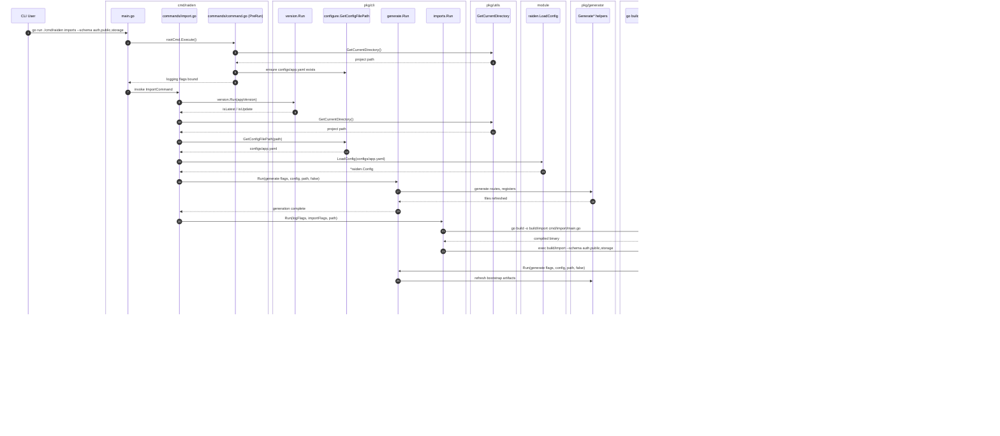

# Imports Command – Sequence Diagram

The diagram maps the runtime steps triggered by `raiden imports`, from CLI invocation through resource reconciliation.

```mermaid
sequenceDiagram
    autonumber
    participant U as CLI User
    box cmd/raiden
        participant Main as main.go
        participant Cmd as commands/import.go
        participant Pre as commands/command.go (PreRun)
    end
    box pkg/cli
        participant Version as version.Run
        participant Configure as configure.GetConfigFilePath
        participant Generate as generate.Run
        participant Imports as imports.Run
    end
    box pkg/utils
        participant Utils as GetCurrentDirectory
    end
    box module
        participant Config as raiden.LoadConfig
    end
    box pkg/generator
        participant Generator as Generate* helpers
    end
    box build
        participant GoBuild as go build cmd/import/main.go
        participant ImportBin as build/import (generated binary)
    end
    box internal
        participant Bootstrap as internal/bootstrap.Register*
    end
    box pkg/resource
        participant Resource as resource.Import
        participant Supabase as resource.Load
        participant State as state.Load
    end

    U->>Main: go run ./cmd/raiden imports --schema auth,public,storage
    Main->>Pre: rootCmd.Execute()
    Pre->>Utils: GetCurrentDirectory()
    Utils-->>Pre: project path
    Pre->>Configure: ensure configs/app.yaml exists
    Pre-->>Main: logging flags bound
    Main->>Cmd: invoke ImportCommand
    Cmd->>Version: version.Run(appVersion)
    Version-->>Cmd: isLatest / isUpdate
    Cmd->>Utils: GetCurrentDirectory()
    Utils-->>Cmd: project path
    Cmd->>Configure: GetConfigFilePath(path)
    Configure-->>Cmd: configs/app.yaml
    Cmd->>Config: LoadConfig(configs/app.yaml)
    Config-->>Cmd: *raiden.Config
    Cmd->>Generate: Run(generate flags, config, path, false)
    Generate->>Generator: generate routes, registers
    Generator-->>Generate: files refreshed
    Generate-->>Cmd: generation complete
    Cmd->>Imports: Run(logFlags, importFlags, path)
    Imports->>GoBuild: go build -o build/import cmd/import/main.go
    GoBuild-->>Imports: compiled binary
    Imports->>ImportBin: exec build/import --schema auth,public,storage
    ImportBin->>Bootstrap: Register models/types/(rpc,roles,storages)
    ImportBin->>Generate: Run(generate flags, config, path, false)
    Generate->>Generator: refresh bootstrap artifacts
    ImportBin->>Resource: Import(flags, config)
    Resource->>Supabase: Load(flags, config)
    Supabase-->>Resource: remote tables/functions/roles/storages
    Resource->>Resource: filter by AllowedSchema
    Resource->>State: Load()
    State-->>Resource: local definitions
    Resource->>Generator: write diffs (unless dry-run)
    Resource-->>ImportBin: import summary (dry-run collects errors)
    ImportBin->>Generate: (optional) regenerate bootstrap if !dry-run
    ImportBin-->>Imports: exit status
    Imports-->>Cmd: import process finished
    Cmd-->>U: exit with success or error
```
