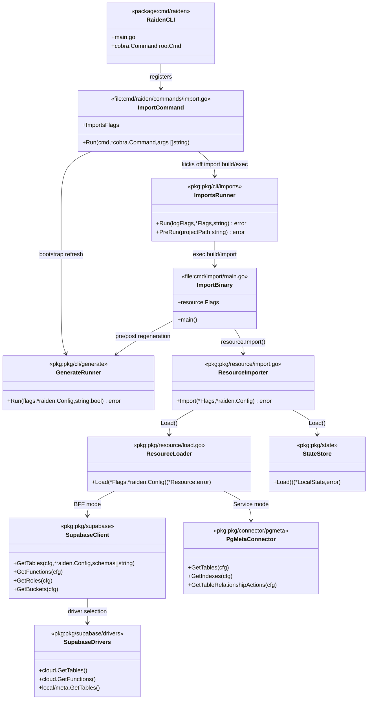

# Imports Command – Structural Diagram

This class-style view highlights the key packages/files involved in `raiden imports` and where external Supabase/PgMeta calls originate.

- `pkg/supabase` delegates HTTP calls to `pkg/supabase/drivers/cloud` (Supabase SQL/PostgREST) or `pkg/supabase/drivers/local/meta`.
- `pkg/connector/pgmeta` issues HTTP requests to PgMeta when running in service mode, feeding schema metadata back to the loader.
